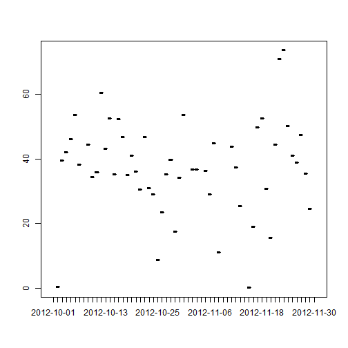

# Reproducible Research: Peer Assessment 1


## Loading and preprocessing the data

The datafile has been downloaded from [Activity Monitoring Data](https://d396qusza40orc.cloudfront.net/repdata%2Fdata%2Factivity.zip) into WS and un-zipped. Filename is "activity.csv".It has been loaded into R by command


```r
setInternet2(TRUE)  # set the R_WIN_INTERNET2 to TRUE
FileUrl="https://d396qusza40orc.cloudfront.net/repdata%2Fdata%2Factivity.zip"
download.file(FileUrl, "activity.zip")       
activity_original <- unzip("activity.zip")

activity <- read.csv(activity_original)
```

## What is mean total number of steps taken per day?


```r
library(plyr)
activity_day <- ddply(activity, .(date), summarise, 
                      stepSum = sum(steps))

hist(activity_day$stepSum, main="Histogram of the total number of steps taken each day", 
            xlab="Total number of steps")
```

 

```r
# Calculate and report the mean and median total number of steps taken per day
mean(activity_day$stepSum, na.rm=T)
```

```
## [1] 10766
```

```r
median(activity_day$stepSum, na.rm=T)
```

```
## [1] 10765
```

## What is the average daily activity pattern?


```r
# make the time series plot

stepAVGData <- ddply(activity, .(date), summarise, stepAVG=mean(steps))

# merge stepAVGData and activity datasets

activity_dayInterval <- merge(activity, stepAVGData, by="date", all.x=TRUE)

## Make the plot

with(activity_dayInterval, plot(date, stepAVG, type="l"))
```

 


##### Imupte the mean steps in that day ####

My strategy of imputation is to calculate the mean steps in each interval and impute the NA with the mean steps in the corresponding interval 


```r
activity$steps<-as.numeric(activity$steps)
activity_interval <- ddply(activity, .(interval), summarise, 
                               MeanSteps = mean(steps, na.rm=T))

activityMissing <- activity[is.na(activity$steps), ]

activityImpute <- merge(activityMissing, activity_interval, by="interval", all.x=T)

#################################

activity$newStep<-0
activity$newStep[is.na(activity$steps)]<-activityImpute$MeanSteps
activity$newStep[!is.na(activity$steps)]<-activity$steps[!is.na(activity$steps)]

activityNew <- subset(activity, select=c(4,2,3))
```

## Are there differences in activity patterns between weekdays and weekends?

Yes, there are more steps during the middle of the day in Weekend and less steps in Weekdays. 


```r
## Convert factor variable to character variable
activityNew$date<-as.character(activityNew$date)
activityNew$date <- as.Date(activityNew$date)

## Create a new factor variable to indicate weekday or weekend
activityNew$WeekTime <- weekdays(activityNew$date)
activityNew$Time[activityNew$WeekTime %in% c("Monday", "Tuesday", "Wednesday", 
                                                     "Thursday", "Friday")] <- "weekday"
activityNew$Time[activityNew$WeekTime %in% c("Saturday", "Sunday")] <- "weekend"
activityNew$Time<-factor(activityNew$Time)
table(activityNew$Time)
```

```
## 
## weekday weekend 
##   12960    4608
```

```r
#### construct 5 min interval dataset

weekdayData <- activityNew[activityNew$Time=="weekday",]
weekday <- ddply(weekdayData, .(interval), summarise, 
                 stepMean = mean(newStep))

weekendData <- activityNew[activityNew$Time=="weekend",]
weekend <- ddply(weekendData, .(interval), summarise, 
                 stepMean = mean(newStep))

par(mfrow=c(2,1))
with(weekend, plot(x=interval, y=stepMean, type='l', col="blue", main="Weekend", 
                   ylab="Number of Steps"))
with(weekday, plot(x=interval, y=stepMean, type='l', col="blue", main="Weekday",
                   ylab="Number of Steps"))
```

 


